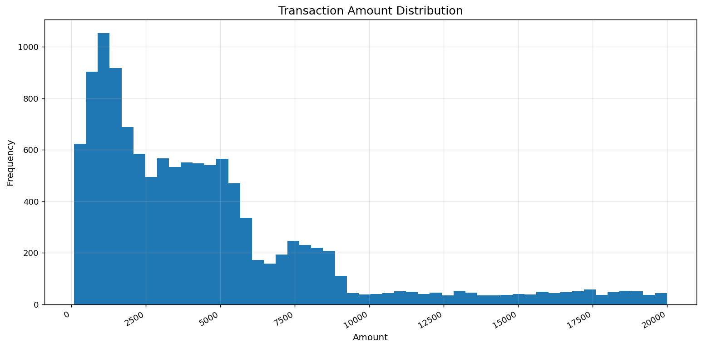
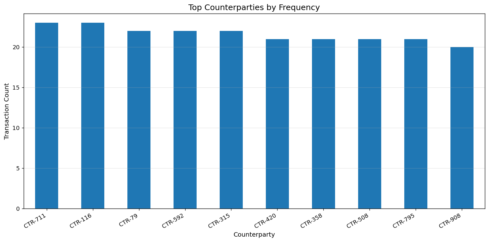
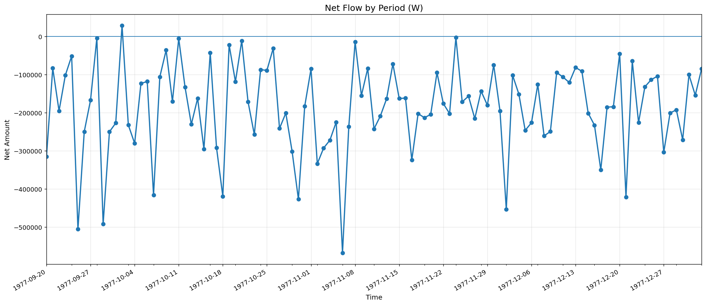
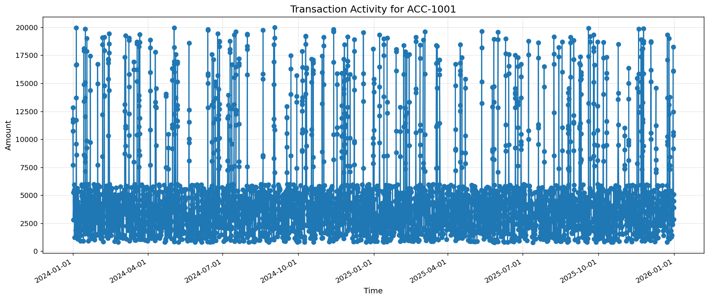

# Operation Cold Ledger


<p align="center">
  <strong>Synthetic Financial Intelligence • Behavioral Analysis • Risk Assessment • Visual Intelligence • Structured Reporting</strong>
</p>

<p align="center">
  A scenario-driven analytical system for detecting irregular financial behavior in a controlled synthetic environment.
</p>

---

## Overview

**Operation Cold Ledger** is a structured analytical project designed to examine suspicious financial behavior through a layered intelligence-oriented workflow.

Rather than treating transaction data as isolated records, the project interprets activity as a behavioral system.  
Its purpose is to identify meaningful irregularities, evaluate pattern interaction, reconstruct activity sequences, and translate technical observations into disciplined analytical judgments.

This repository combines:

- synthetic transaction generation
- data cleaning and normalization
- behavioral anomaly detection
- timeline reconstruction
- counterparty relationship mapping
- risk scoring
- visual pattern analysis
- intelligence-style reporting

The project is not built as a generic data exercise.  
It is built as a **repeatable analytical environment** intended to reflect how structured financial review, behavioral interpretation, and evidence-based reporting can work together inside a controlled case model.

---

## Mission

The mission of Operation Cold Ledger is to develop an analytical workflow that is:

- disciplined
- reproducible
- behavior-focused
- evidence-aware
- operationally readable

The goal is not to simulate offensive action or target real entities.  
The goal is to build an **analytical operator mindset** capable of working through ambiguity, signal overlap, and incomplete context.

Core mission outcomes include:

- disciplined anomaly review
- stronger pattern recognition habits
- clearer separation of observation and assessment
- structured confidence-aware reporting
- professional GitHub-visible analytical output

---

## Scenario

A synthetic dataset is received containing suspicious financial activity associated with a subject of interest.

Initial signals suggest:

- repeated account-level changes
- irregular inflow and outflow behavior
- non-uniform transaction timing
- counterparty concentration patterns
- cross-border exposure variation
- periods of compressed behavioral activity

The analytical task is not simply to describe the data.

The task is to determine:

- what patterns are visible
- which anomalies are significant
- how indicators reinforce one another
- what behavioral hypotheses emerge
- what level of concern is analytically justified
- which areas require continued monitoring

This project treats uncertainty as part of the workflow rather than as a failure condition.

---

## Why This Project Exists

Many projects stop at charts, summary statistics, or rule-based detection.

Operation Cold Ledger is built to go further by asking:

- What happened?
- In what sequence did it happen?
- Which signals matter alone, and which matter only in combination?
- What changes when activity is viewed behaviorally rather than transaction-by-transaction?
- How should findings be communicated to a decision-maker?

This repository exists to bridge the gap between:

- raw transaction analysis
- behavioral interpretation
- intelligence-style reporting

---

## Visual Intelligence Snapshot

The repository includes a visual layer so that pattern recognition is not limited to text-heavy reporting.

### Transaction Value Distribution
<p align="center">
  
</p>

**What it shows:**  
This visualization helps identify the overall shape of transaction values across the dataset. A skewed distribution may indicate that most activity remains routine while a smaller subset of movements carries disproportionate analytical importance.

**Why it matters:**  
High-value tails, clustering near unusual ranges, or abrupt imbalance in value distribution can strengthen anomaly review and help focus attention on non-routine movement patterns.

---

### Counterparty Concentration
<p align="center">
  
</p>

**What it shows:**  
This visualization highlights counterparties that appear most frequently in the observed transaction environment.

**Why it matters:**  
Repeated interaction with a narrow set of counterparties may indicate routine dependency, routing concentration, staged movement behavior, or structurally important transaction partners. It is especially useful when single-account review is no longer sufficient.

---

### Net Flow by Period
<p align="center">
  
</p>

**What it shows:**  
This chart compares aggregate financial inflow and outflow over time and makes net directional movement easier to interpret.

**Why it matters:**  
Net flow analysis can reveal whether the environment is operating with steady balance, intermittent spikes, or short-duration outbound pressure. It helps distinguish ordinary volume from potentially structured movement phases.

---

### Account Activity Timeline — ACC-1001
<p align="center">
  
</p>

**What it shows:**  
This account-focused view highlights temporal activity patterns for a selected subject account.

**Why it matters:**  
Burst behavior, off-hour activity, abrupt shifts in value, and timing compression become easier to identify visually than through raw tables alone. This supports both anomaly interpretation and timeline reconstruction.

---

## Objectives

The project is designed to:

- identify abnormal transaction behavior in synthetic financial data
- build a structured and repeatable analytical workflow
- connect technical detection to behavioral interpretation
- develop intelligence-style reporting discipline
- translate signal clusters into risk-oriented judgments
- create clear and defensible analytical outputs
- support visual rather than purely narrative review

---

## Analytical Scope

Operation Cold Ledger focuses on the following analytical layers:

- transaction flow analysis
- behavioral anomaly detection
- account event correlation
- timeline reconstruction
- counterparty and exposure analysis
- risk indicator mapping
- account-level and subject-level assessment
- visual pattern interpretation
- structured intelligence reporting

The scope is intentionally synthetic but methodologically serious.

---

## Analytical Framework

This repository is built around a layered analytical model:

1. **Synthetic Data Generation**  
   Controlled synthetic case data is created to support repeatable analysis.

2. **Data Cleaning and Normalization**  
   Timestamps, transaction values, categorical fields, and helper features are normalized to protect analytical integrity.

3. **Behavioral Anomaly Detection**  
   Rule-based checks identify suspicious timing, concentration, cross-border variation, and account-event-linked movement.

4. **Timeline Reconstruction**  
   Events are reconstructed chronologically to support sequence-based interpretation rather than isolated review.

5. **Relationship Mapping**  
   Counterparty exposure, concentration, and account-to-partner structure are examined at the relational level.

6. **Risk Scoring**  
   Analytical signals are converted into triage-oriented heuristic scores to support prioritization.

7. **Visual Pattern Analysis**  
   Distribution, flow, concentration, and temporal behavior are interpreted visually.

8. **Structured Intelligence Reporting**  
   Findings are converted into executive, technical, and assessment-oriented outputs.

Each layer reduces ambiguity and increases interpretive confidence.

---

## Analytical Pipeline

```text
Synthetic Data Generation
        ↓
Data Loading
        ↓
Data Cleaning & Validation
        ↓
Behavioral Anomaly Detection
        ↓
Timeline Reconstruction
        ↓
Relationship Mapping
        ↓
Risk Scoring
        ↓
Visual Pattern Analysis
        ↓
Structured Reporting

operation-cold-ledger/
│
├── README.md                    # Project overview, framework, and positioning
├── assets/
│   └── diagrams/                # Visual outputs and analytical figures
├── data/
│   ├── raw/                     # Synthetic raw transaction data
│   ├── processed/               # Cleaned and prepared data outputs
│   └── intel/                   # Subject context and scenario notes
├── notebooks/                   # End-to-end exploratory and visual analysis
├── reports/                     # Executive, technical, and intelligence-style outputs
└── src/                         # Modular analytical pipeline components
# Operation-Cold-Ledger

# Operation-Cold-Ledger